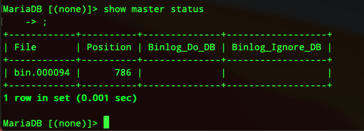
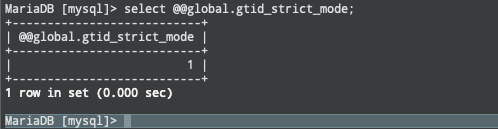
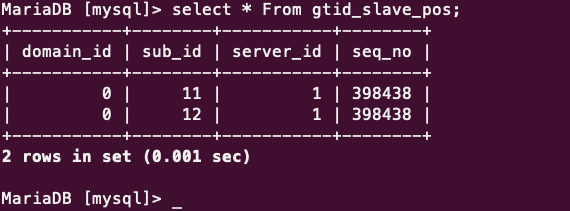
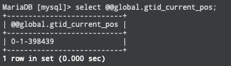
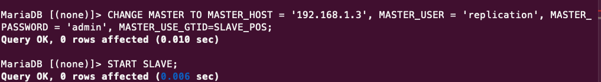

docker run -p 127.0.0.1:3308:3306  --name some-mariadb -e MARIADB_ROOT_PASSWORD=admin -d mariadb:tag

mysql --host=127.0.0.1 --port=3308 -u root -p


# Books mariadb-high-performance
# MariaDB Replication

Settting up MariaDB slave

```sh
sudo apt-get update

sudo apt install mariadb-server

grant ALL PRIVILEGES ON *.* TO 'sudeep'@'localhost' IDENTIFIED BY 'admin';
```


## Standard Replication 
   1. Configuring the master node
    my.cnf file

    [mysqld]
    server-id=1
    bind-address = 0.0.0.0
    log_bin=/var/log/mysql/mariadb-bin
    
    These are the minimum options. Let's study them in detail:

server-id: This should be a unique ID. Here, we've chosen 1 but you can choose a number up to 2^32-1.
bind-address: This is the IP address on which the MariaDB instance should listen. By default, it is 127.0.0.1. You can bind it to 192.168.33.31 if you want to listen only on this interface. With 0.0.0.0, we want to bind on all available interfaces.
log-bin: This is where you can store the binary logs.
Now, we are able to build a master/slave replication. There are other options that you should be aware of:

expire_logs_days=10
sync_binlog = 1
slave_compressed_protocol
transaction-isolation = READ COMMITTED
binlog_format = row
Let's see how useful these options can be:

expire_logs_days: This is the number of days for binlogs retention. This is generally used to avoid binlogs taking all the disk space indefinitely. After 10 days (here), it is automatically flushed.
TIP
This also means if you have a delta between your master and your slave that is bigger than 10 days, you won't be able to resume the replication but you will need to do a full sync instead!

sync_binlog: This will synchronize the binary logfile to the disk (flush) after each write event. Set this value to 1 to activate this functionality. This is the safest choice but also the slowest. Disable it if you need more replication performances.
slave_compressed_protocol: This will use compression if the slave gets the option too. This consumes a little bit more of CPU, but makes the replication faster.
binlog_format: This chooses which kind of binlog format you want (row, statement, or mixed). The row format is the best to guarantee safe replications.
Now, restart your MariaDB master instance to activate your new options

2.    Preparing the master node
```sql
    MariaDB [(none)]> create user 'replication'@'%' identified by 'admin';
Query OK, 0 rows affected (0.050 sec)

MariaDB [(none)]> GRANT REPLICATION  SLAVE ON *.* TO 'replication'@'%';
Query OK, 0 rows affected (0.049 sec)

flush privileges
```
```sql
    SHOW MASTER STATUS

```


# Configuring the slave node
```sh
#
# This group is read both both by the client and the server
# use it for options that affect everything
#
[client-server]

#
# include *.cnf from the config directory
#
!includedir /usr/local/etc/my.cnf.d
[mysqld]
server-id=1
bind-address=0.0.0.0
log-bin=bin.log
log-bin-index=bin-log.index
binlog_format=row
log_output=TABLE
general_log
# log_disabled_statements='slave,sp'
slow_query_log
long_query_time=1
performance_schema=on

expire_logs_days=10
sync_binlog = 1
slave_compressed_protocol
#transaction-isolation = READ COMMITTED
#binlog_format = row
```

```sql
MariaDB [(none)]> flush tables with read lock;
```
```sh
 
> mysqldump -uroot -p --opt --routines --triggers --events --single-transaction --master-data=2 -A > alldb.sql

```
```sql

MariaDB [(none)]> unlock tables;

mysql -uroot -p < alldb.sql

Now, to be ready to start the slave, we need to get the binary logfile and position written in the dump file, if you've chosen the master-data option to be 1:

> grep -m 1 "^-- CHANGE MASTER" alldb.sql
-- CHANGE MASTER TO MASTER_LOG_FILE='mariadb-
bin.000012', MASTER_LOG_POS=328;


 grant ALL PRIVILEGES ON *.* TO 'sudeep'@'localhost' IDENTIFIED BY 'admin';
CHANGE MASTER TO MASTER_HOST = '192.168.1.3', MASTER_USER = 'replication', MASTER_PASSWORD = 'admin', MASTER_LOG_FILE = 'bin.000094',  MASTER_LOG_POS = 786;
```

# GTID Replication
The big difference with the classical replication is that GTID of the last applied transaction is stored in the gtid_slave_pos file of the mysql database. This table is updated each time a transaction is written. If the slave crashes, it is easy for it to catch the last state position and see with the master if it matches the last transaction commit. Having the same GTID number permits us to get consistent binlogs as well.


GTID replication
GTID has been introduced in MariaDB 10 and adds a new event to each transaction in the binlog. This new event is the Global ID that gives a unique identifier across all the replicated servers. This is how it is different from the classical replication. One of the big advantages is that you can now easily change the master as you get the same transaction ID across all nodes.

The other important thing is the slave is recorded in a crash-safe way. This involves using a transactional engine like InnoDB to be fully crash-safe.

The big difference with the classical replication is that GTID of the last applied transaction is stored in the gtid_slave_pos file of the mysql database. This table is updated each time a transaction is written. If the slave crashes, it is easy for it to catch the last state position and see with the master if it matches the last transaction commit. Having the same GTID number permits us to get consistent binlogs as well.

An important thing to know is classical replication is still available to maintain backward compatibility. However, GTID replication is enabled by default on MariaDB 10!

## What is GTID
We've talked about the GTID replication solution, which is the best, but what is a GTID exactly? It is composed of three separated dashed numbers like x-y-z. They are explained as follows:

x: This is the first number, that is, the domain ID
y: This is the second number, that is, the server ID (as classical replication)
z: This is the third number, that is, the sequence number (increasing on each event)

## Configuring the master node

he configuration of the master node is very similar to the classical replication. Nothing different on that side, so you can pick up the same configuration:
```sh
[mysqld]
server-id=1
bind-address = 0.0.0.0
log_bin=/var/log/mysql/mariadb-bin
expire_logs_days=10
sync_binlog = 1
slave_compressed_protocol = 1
binlog_format = row

**gtid_strict_mode=1**

```
**gtid_strict_mode=1**

```SQL

You can then check the global variable status with the following command:

MariaDB [(none)]> select @@global.gtid_strict_mode;
select * From gtid_slave_pos;
```


### On Slave Machine






## Configuring a GTID slave node
Slave config
```sh
# Import all .cnf files from configuration directory
!includedir /etc/mysql/conf.d/
!includedir /etc/mysql/mariadb.conf.d/
[mariadb]
server-id=2
bind-address=0.0.0.0
slave_compressed_protocol = 1
binlog_format = row
read_only
log_bin = /var/log/mysql/mysql-bin.log
log_bin_index =/var/log/mysql/mysql-bin.log.index
relay_log = /var/log/mysql/mysql-relay-bin
relay_log_index = /var/log/mysql/mysql-relay-bin.index
replicate-do-db=employees
gtid_strict_mode=1
```
**gtid_strict_mode=1**

restart mariadb services
```SQL
stop slave
start slave
reset slave
take current gtid from Master Node
select @@global.gtid_current_pos;

On slave set it;
set global gtid_slave_pos = "0-1-398439";

MariaDB [(none)]> CHANGE MASTER TO MASTER_HOST = '192.168.1.3', MASTER_USER = 'replication', MASTER_PASSWORD = 'admin', MASTER_USE_GTID=SLAVE_POS;

start slave;
```



troubleshoot replication
stop slave
show master staus;
reset master
show master status;