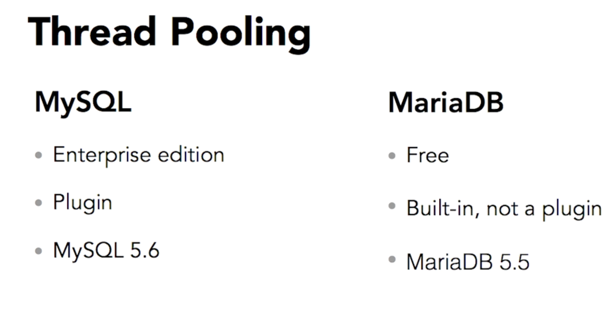
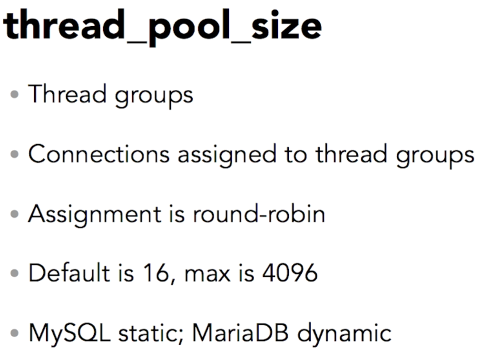
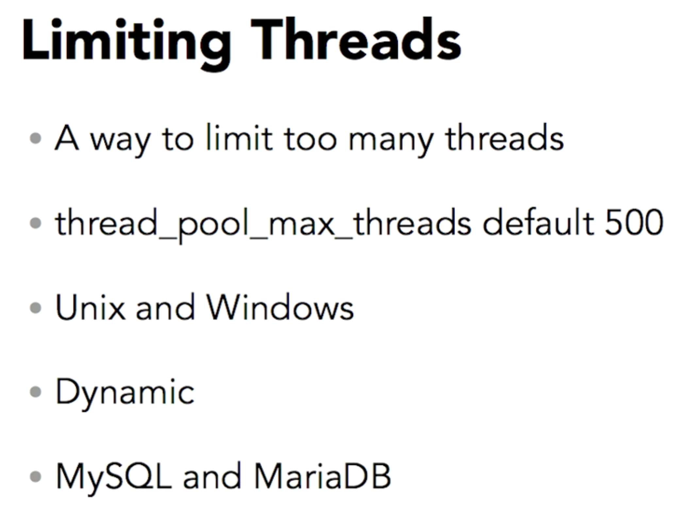
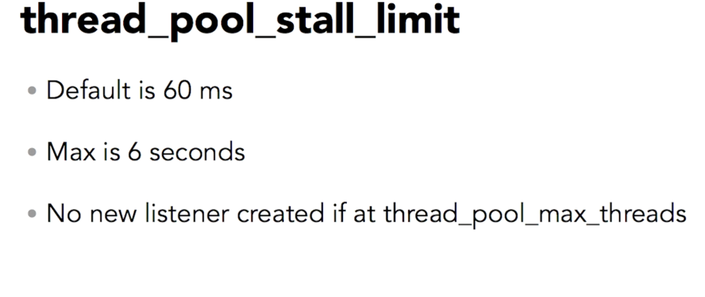
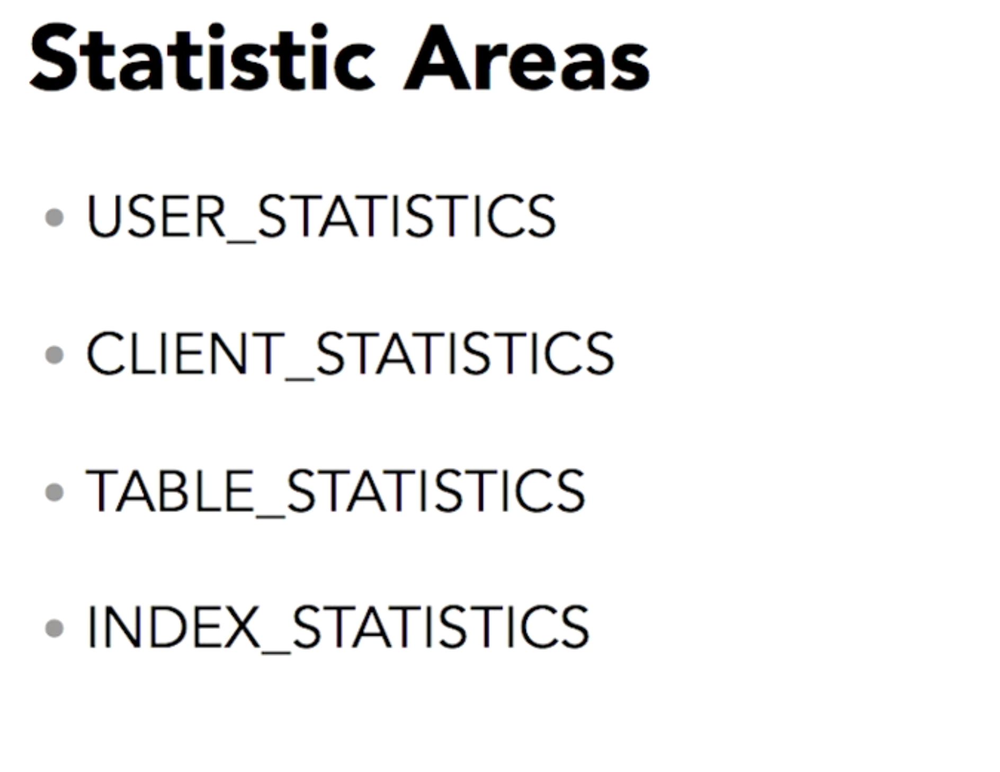
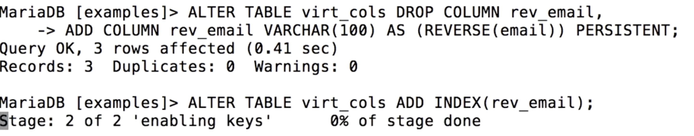
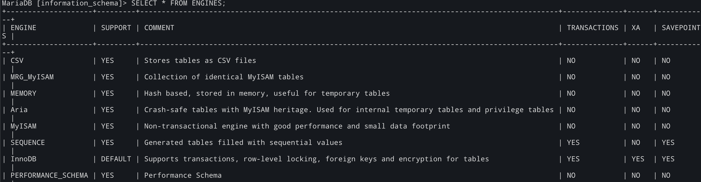
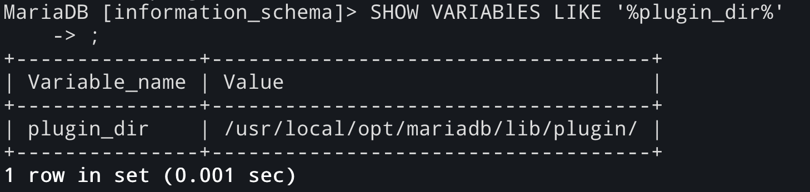
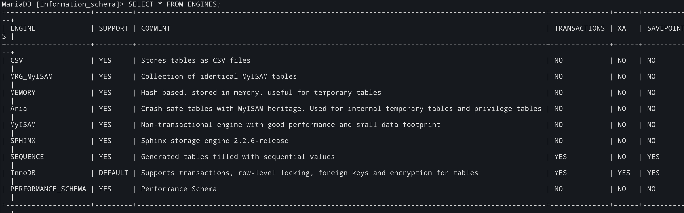

# Select a user from mysql client in command line
select user()

# Switch a user in command line with mysql client
```SQL
system mysql -u gouser -p

show grants for sp628k@localhost


```

# Set Native authentication 
Error: golang
starting access to database from go lang
[mysql] 2021/09/02 17:23:26 connector.go:95: could not use requested auth plugin 'mysql_native_password': this user requires mysql native password authentication.
2021/09/02 17:23:26 this user requires mysql native password authentication.
exit status 1

```SQL
alter user root@'localhost' identified with mysql_native_password by
```

# Server Thread Pooling
1 connetion == 1 thread, does not scale 

## use thread pool










# User Statistics

```sql
SHOW variables like '%userstat%';

Set global userstat=1;

select * from information_schema.user_statistics;

 mysqladmin proc stat

mysql -u sp628k -h localhost  -p -e "select * from mysql.slow_log\G"





SHOW CLIENT statistics;
select * from INFORMATION_SCHEMA.TABLE_STATISTICS;
```


# Virtual Columns ARE CALCULATED

```SQL
create table virt_cols (
    -> email VARCHAR(100) NOT NULL,
    -> unixtime INT NOT NULL,
    -> rev_mail VARCHAR(100) AS (REVERSE(email)) VIRTUAL,
    -> dt DATETIME as (FROM_UNIXTIME(unixtime)) VIRTUAL);
```

# Persistent Columns Virtual Column





# Sphinx Storage Engine Full text search
```sql
-- Instll plugin
MariaDB [information_schema]> SELECT * FROM ENGINES;





 SHOW VARIABlES LIKE '%plugin_dir%'

| plugin_dir    | /usr/local/opt/mariadb/lib/plugin/ |


MariaDB [information_schema]> \! ls -1 /usr/local/opt/mariadb/lib/plugin/

```
```sql
INSTALL PLUGIN SPHINX SONAME 'ha_sphinx';


```

## CREATING SPHINX TABLE
```sql


```